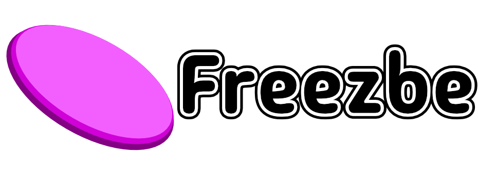
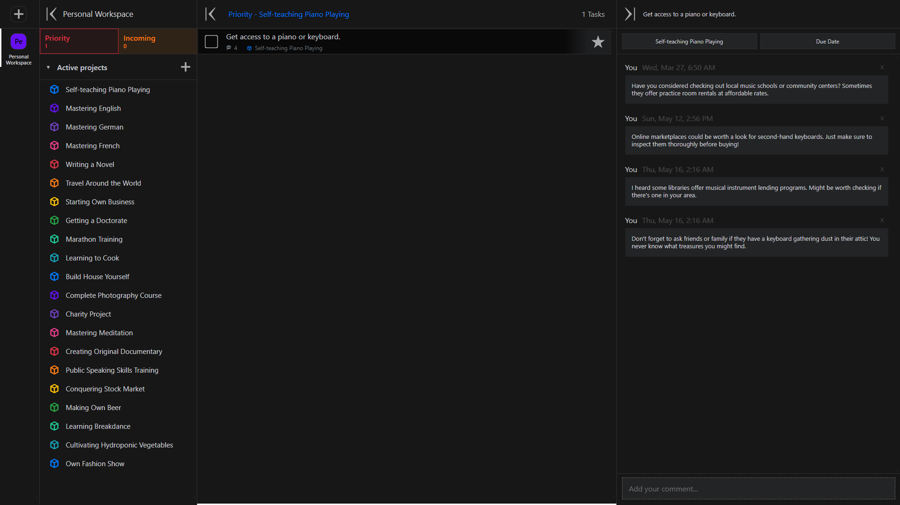

## Einführung:

Freezbe ist eine Aufgabenverwaltungsanwendung, die vollständige Datensicherheit gewährleistet – Ihre Daten werden nirgendwohin gesendet. 
Die Benutzeroberfläche ist für mobile Benutzer konzipiert und ermöglicht auch eine bequeme Nutzung mit einer Tastatur. 

## Wichtig:

Die Anwendung speichert Daten im Local Storage. 
Wenn Sie vorhaben, Ihren Browser zu bereinigen, stellen Sie sicher, dass Sie den Arbeitsbereich, an dem Sie arbeiten, exportieren, um Datenverlust zu vermeiden.

## Funktionen:

-   **Zonen**: Die Anwendung kann bis zu 4 sichtbare Zonen anzeigen: Arbeitsbereich, Projekte, Aufgaben, Details. 
    Jede Zone kann aktiv sein.
-   **Arbeitsbereich**: Gruppiert Projekte.
-   **Projekte**: Gruppiert Aufgaben.
-   **Details**: Können Aufgabendetails, einschließlich Kommentare, enthalten.

 

## Motivation

Die Hauptmotive für meine Teilnahme am Wettbewerb sind die folgenden Faktoren:

-   Ein Produkt zu schaffen, das ich nutzen werde.
-   Übung in Beständigkeit.
-   Übung im Reverse Engineering.
-   Erweiterung meines technologischen Stacks mit neuen Technologien.
-   Hinzufügen eines interessanten Eintrags zu meinem Lebenslauf.

## Benutzeroberfläche

