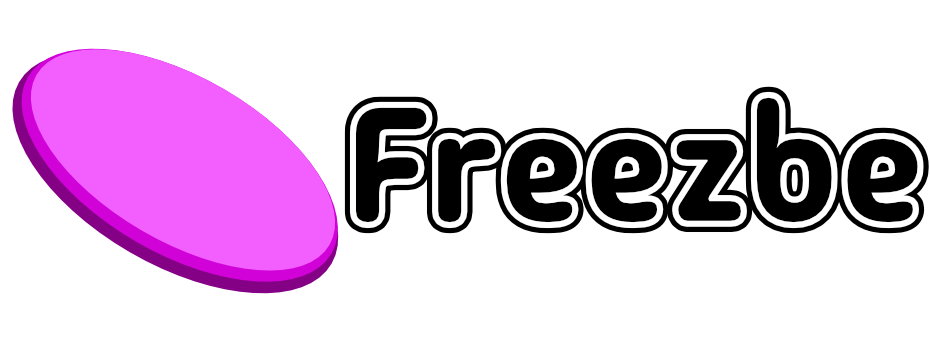
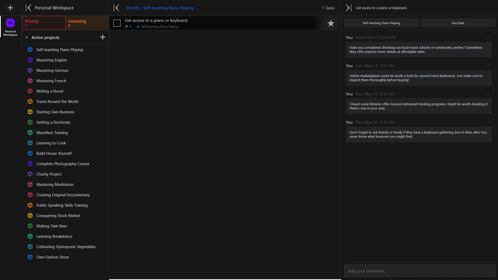

## Wprowadzenie:

Freezbe to aplikacja do zarządzania zadaniami, która zapewnia pełną prywatność danych – twoje dane nigdzie nie są wysyłane.
Interfejs użytkownika został zaprojektowany z myślą o użytkownikach mobilnych, ale jest również w pełni funkcjonalny na komputerach stacjonarnych. 

## Ważne:

Aplikacja przechowuje dane w Local Storage.
Jeśli planujesz wyczyścić przeglądarkę, upewnij się, że wyeksportowałeś przestrzeń roboczą, nad którą pracujesz, aby uniknąć utraty danych.

## Funkcje:

- **Strefy**: Aplikacja może wyświetlać do 4 widocznych stref: Przestrzeń Robocza, Projekty, Zadania, Szczegóły. 
  Każda strefa może być aktywna.
- **Przestrzeń Robocza**: Grupuje projekty.
- **Projekty**: Grupują zadania.
- **Szczegóły**: Mogą zawierać szczegóły zadania, w tym komentarze.

## Motywacja:

Główne motywacje do udziału w konkursie dla mnie to następujące czynniki:

- Tworzenie produktu, którego będę używać.
- Ćwiczenie konsekwencji.
- Ćwiczenie inżynierii wstecznej.
- Rozszerzanie mojego stosu technologicznego o nowe technologie.
- Dodawanie interesującego wpisu do mojego CV.

## UI

